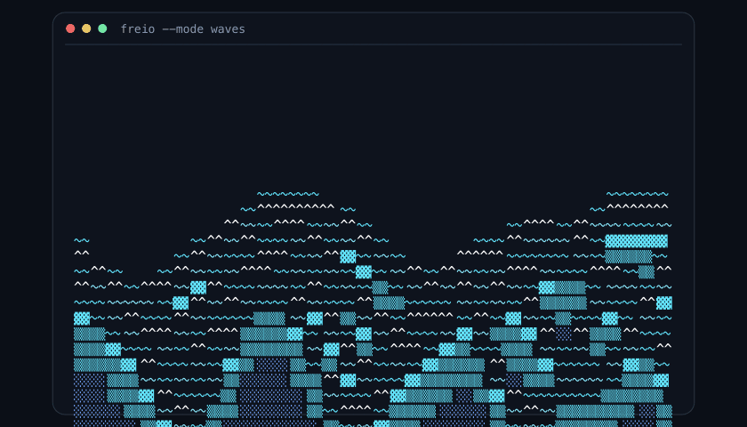
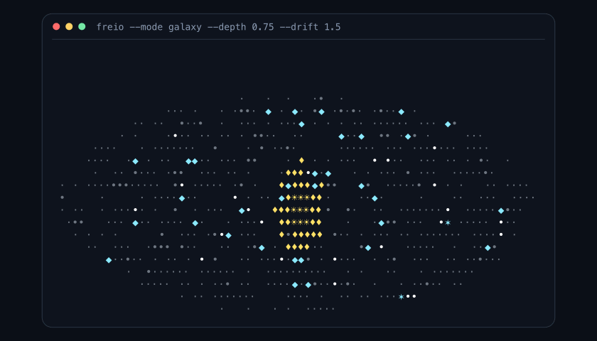
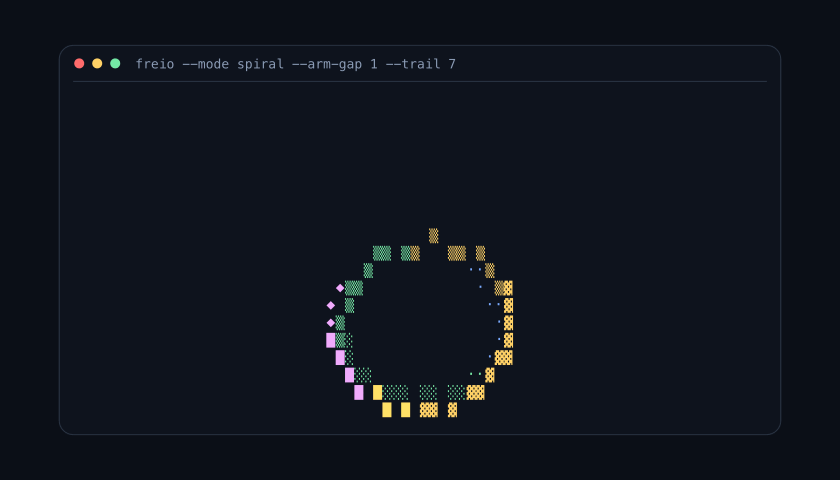
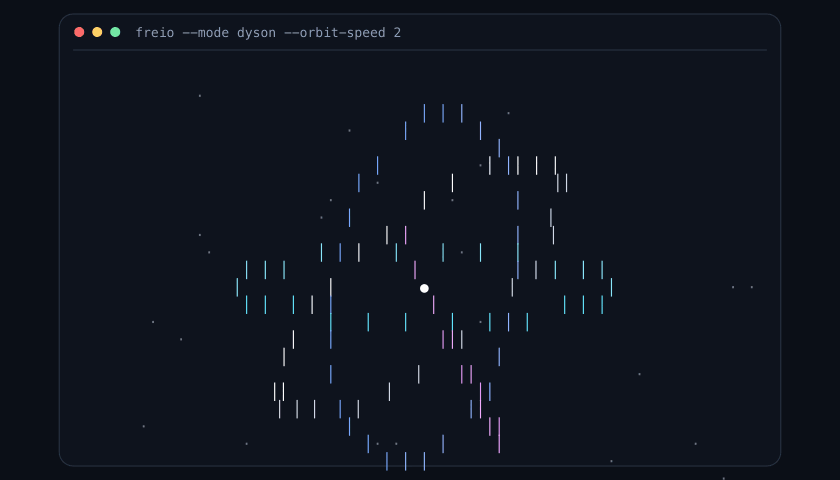
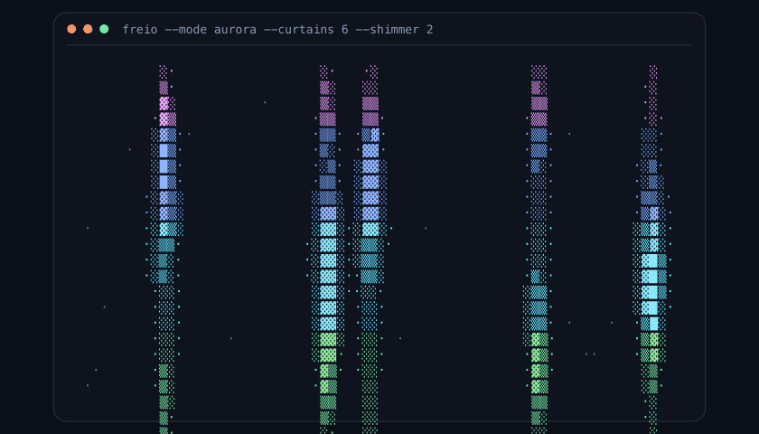
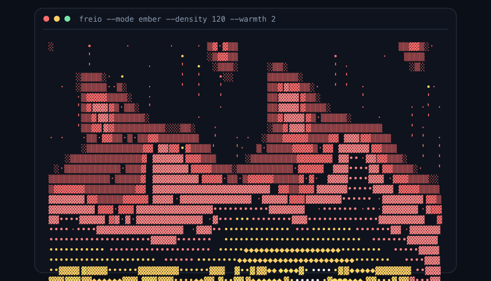
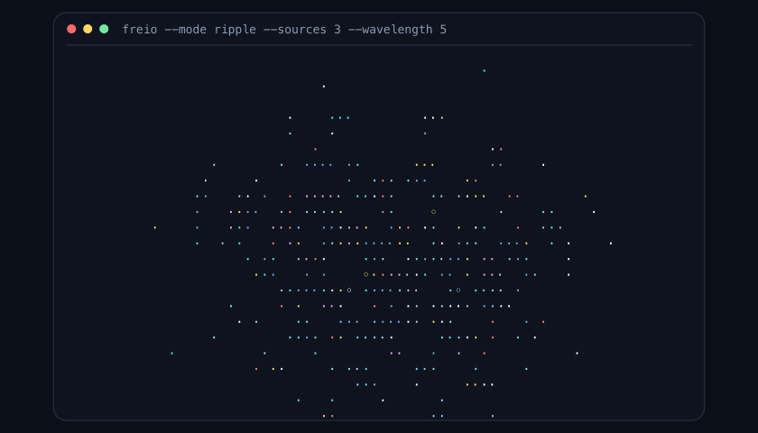
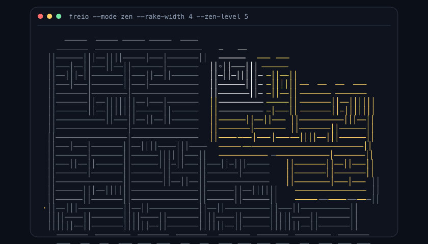
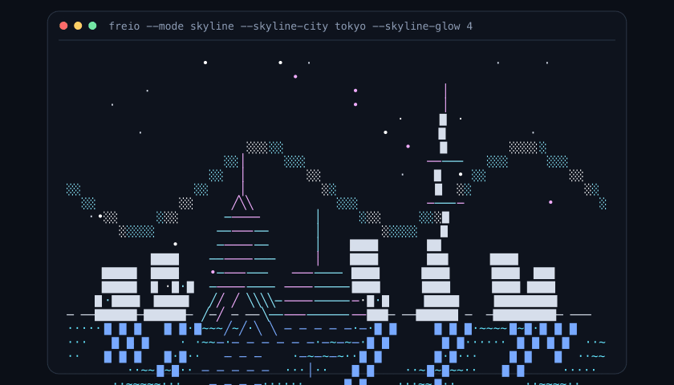

# Freio

Retro-futuristic terminal visualizers: waves, galaxies, zen gardens, glowing city skylines, and more. Freio runs entirely in your terminal with no runtime dependencies.



## Install and launch

Freio requires Python 3.10 or later. Install it with `pipx`:

```bash
pipx install -e .
```

Then launch the saved opening animation, or Waves when no opening animation has been saved:

```bash
freio
```

Jump straight into a mode with `--mode`:

```bash
freio --mode galaxy
freio --mode skyline
freio --mode zen
```

Use `--size` to make a fixed square canvas; otherwise Freio fits the available terminal space.

```bash
freio --mode aurora --size 31
```

## Learn the controls

Launch Freio, then use the HUD as your guide. It names the two live settings for the current mode and shows their values.

| Key | What it does |
| --- | --- |
| `Space` | Move to the next visualization |
| `Left` / `Right` | Decrease / increase slider 1 — the mode's shape control |
| `Up` / `Down` | Increase / decrease slider 2 — the mode's feel or motion control |
| `r` | Reverse the animation direction |
| `c` | Cycle Skyline colorways when the Skyline visualizer is active |
| `f` or `e` | Toggle the HUD-free fullscreen canvas |
| `Esc` | Leave fullscreen and restore the HUD |
| `s` | Open or close Settings |
| `l` | Save the current mode and slider values as the opening animation |
| `u` | Clear the saved opening animation while Settings is open |
| `q` | Quit |

The launch hint fades after a few seconds, but the control scheme does not change from mode to mode: `Space` navigates, horizontal arrows tune the first slider, and vertical arrows tune the second.

## Choose a visualizer

Every GIF below is generated from Freio's renderer and shows the command that starts it. Use the two keyboard sliders for live exploration, or use the listed command as a reproducible starting point.

### Waves — layered ocean motion


`Left` / `Right` adjusts **Amplitude**; `Up` / `Down` adjusts **Frequency**.

```bash
freio --mode waves --wave-count 4
freio --mode waves --no-foam --speed 7
```

### Galaxy — rotating spiral arms



`Left` / `Right` adjusts **Depth**; `Up` / `Down` adjusts **Drift**.

```bash
freio --mode galaxy --depth 0.75 --drift 1.5
```

### Spiral — expanding droid-like trace



`Left` / `Right` adjusts **Trail**; `Up` / `Down` adjusts **Growth**.

```bash
freio --mode spiral --arm-gap 1 --trail 7
```

### Dyson — satellites collecting into rings



`Left` / `Right` adjusts **Quantity**; `Up` / `Down` adjusts **Orbit**.

```bash
freio --mode dyson --orbit-speed 2
```

### Aurora — colored, shimmering curtains



`Left` / `Right` adjusts **Curtains**; `Up` / `Down` adjusts **Shimmer**.

```bash
freio --mode aurora --curtains 6 --shimmer 2
```

### Ember — fire, sparks, and heat



`Left` / `Right` adjusts **Density**; `Up` / `Down` adjusts **Warmth**.

```bash
freio --mode ember --density 120 --warmth 2
```

### Ripple — drifting interference patterns



`Left` / `Right` adjusts **Sources**; `Up` / `Down` adjusts **Wavelength**.

```bash
freio --mode ripple --sources 3 --wavelength 5
```

### Zen — a settling terminal sand garden



`Left` / `Right` adjusts **Rake** width; `Up` / `Down` adjusts **Detail**.

```bash
freio --mode zen --rake-width 4 --zen-level 5
```

### Skyline — a cinematic city tour



`Left` / `Right` picks a **City** (including the automatic tour); `Up` / `Down` adjusts **Glow**.

```bash
freio --mode skyline --skyline-city tokyo --skyline-glow 4
```

Available city values are `auto`, `newyork`, `paris`, `london`, `tokyo`, `sydney`, and `dubai`.

## Customize from the command line

These options work with any mode unless noted otherwise.

| Flag | Default | Effect |
| --- | --- | --- |
| `--mode MODE` | saved mode or `waves` | Start in `waves`, `galaxy`, `spiral`, `dyson`, `aurora`, `ember`, `ripple`, `zen`, or `skyline` |
| `--size N` | auto-fit | Use an `N × N` canvas instead of fitting the terminal |
| `--speed N` | `5` | Change animation speed; higher is faster |
| `--brightness N` | `100` | Set brightness as a percentage |
| `--ascii` | off | Replace Unicode drawing characters with ASCII-safe characters |
| `--oneshot` | off | Draw one frame and exit — useful for scripts and screenshots |

Mode-specific options:

| Mode | Options |
| --- | --- |
| Waves | `--wave-count N`, `--no-foam` |
| Galaxy | `--depth N`, `--drift N` |
| Spiral | `--arm-gap N`, `--trail N` |
| Dyson | `--orbit-speed N` |
| Aurora | `--curtains N`, `--shimmer N` |
| Ember | `--density N`, `--warmth N` |
| Ripple | `--sources N`, `--wavelength N` |
| Zen | `--rake-width N`, `--zen-level N` |
| Skyline | `--skyline-city CITY`, `--skyline-glow N` |

For example, this creates a dim, portable ASCII aurora:

```bash
freio --mode aurora --curtains 7 --shimmer 2.5 --brightness 45 --ascii
```

## Save an opening animation

Find a combination you like, then press `l`. Freio stores the current mode and its slider values locally and uses them the next time you run plain `freio`. Pass `--mode` to override that saved choice for one launch. Press `s` to open Settings, where `u` clears the saved opening animation.

Settings are stored in Freio's local config directory as `settings.json`; Settings displays the exact path for your machine.

## Crash reporting and privacy

Freio includes an optional in-app crash-reporting screen from Freio Labs, LLC. If enabled, crash logs may be drafted for GitHub issue submission so terminal and cursor crashes can be diagnosed.

Crash logs can include the active visualization mode, terminal size, Python and OS details, command-line arguments, and a traceback. Freio redacts your home directory and GitHub token before writing or submitting reports. Local reports are written to your user cache directory by default.

GitHub submission requires opt-in plus `FREIO_GITHUB_REPO=owner/repo` and `FREIO_GITHUB_TOKEN`. Choose `N` on the consent screen, run `freio --crash-reporting off`, or set `FREIO_CRASH_REPORTING=off` to opt out.

| Flag | Default | Effect |
| --- | --- | --- |
| `--crash-reporting auto\|off` | `auto` | Show the consent flow by default, or disable crash reporting |
| `--crash-report-dir PATH` | user cache | Write local crash report JSON files to `PATH` |

## Refreshing the README GIFs

The GIFs are reproducible assets, not mockups. After changing a renderer, regenerate them from the project root:

```bash
python scripts/generate_readme_gifs.py
```

The generator needs ImageMagick (`magick`) and Inkscape (`inkscape`) to convert Freio's ANSI frames into optimized GIFs.

## Credits

Made with love by [Exponent Ventures](https://exponentventures.com) and [Freio Labs](https://freiolabs.com).
